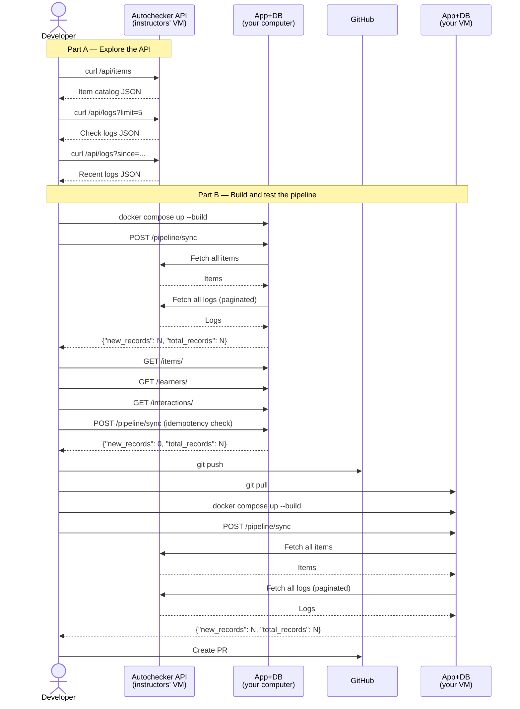

# Build the Data Pipeline

<h4>Time</h4>

~50 min

<h4>Purpose</h4>

Build an ETL pipeline that fetches data from an external API and loads it into the database.

<h4>Context</h4>

The database starts empty. We can get anonymized data on task completions in `Autochecker` API. Your job is to build a pipeline that fetches this data and populates your database so the system can serve it through existing endpoints to display as analytics.

<h4>Diagram</h4>



<h4>Table of contents</h4>

- [1. Steps](#1-steps)
  - [1.1. Follow the `Git workflow`](#11-follow-the-git-workflow)
  - [1.2. Create a `Lab Task` issue](#12-create-a-lab-task-issue)
  - [1.3. Part A: Explore the API](#13-part-a-explore-the-api)
    - [1.3.1. Fetch the item catalog](#131-fetch-the-item-catalog)
    - [1.3.2. Fetch check logs](#132-fetch-check-logs)
    - [1.3.3. Test incremental sync](#133-test-incremental-sync)
  - [1.4. Part B: Build the pipeline](#14-part-b-build-the-pipeline)
    - [1.4.1. Read the code stubs](#141-read-the-code-stubs)
    - [1.4.2. Implement the pipeline](#142-implement-the-pipeline)
    - [1.4.3. Run and test locally](#143-run-and-test-locally)
    - [1.4.4. Verify the data locally](#144-verify-the-data-locally)
    - [1.4.5. Test idempotency locally](#145-test-idempotency-locally)
    - [1.4.6. Commit and push your work](#146-commit-and-push-your-work)
    - [1.4.7. Update and test on the VM](#147-update-and-test-on-the-vm)
  - [1.5. Finish the task](#15-finish-the-task)
  - [1.6. Check the task using the autochecker](#16-check-the-task-using-the-autochecker)
- [2. Acceptance criteria](#2-acceptance-criteria)

## 1. Steps

### 1.1. Follow the [`Git workflow`](../../../wiki/git-workflow.md)

Follow the [`Git workflow`](../../../wiki/git-workflow.md) to complete this task.

### 1.2. Create a `Lab Task` issue

1. Create a `GitHub` issue titled:

   ```text
   [Task] Build the Data Pipeline
   ```

2. To create a branch for the task,

   [run in the `VS Code Terminal`](../../../wiki/vs-code.md#run-a-command-in-the-vs-code-terminal):

   ```terminal
   git checkout main
   git pull origin main
   git checkout -b task/1-build-data-pipeline
   ```

   We named the branch `task/1-build-data-pipeline` because:
   - The issue number (`1`) ties the branch to the task issue directly.
   - The short title (`build-data-pipeline`) makes branch purpose clear in PR lists and `Git` history.
   - The pattern reduces naming collisions across the team.

### 1.3. Part A: Explore the API

<!-- no toc -->
- [1.3.1. Fetch the item catalog](#131-fetch-the-item-catalog)
- [1.3.2. Fetch check logs](#132-fetch-check-logs)
- [1.3.3. Test incremental sync](#133-test-incremental-sync)

Before writing code, let's explore the `Autochecker` API.

The API has HTTP Basic Auth, we'll use `curl` to send requests.

#### 1.3.1. Fetch the item catalog

1. To fetch the lab/task catalog,

   [run in the `VS Code Terminal`](../../../wiki/vs-code.md#run-a-command-in-the-vs-code-terminal):

   ```terminal
   curl \
     -u <your-email>@innopolis.university:<github-username><telegram-alias> \
     "https://auche.namaz.live/api/items"
   ```

   Replace `<your-email>` and `<github-username><telegram-alias>` with the credentials you entered in `Autochecker` bot.

   You should see a `JSON` array of labs and tasks from this course:

   ```json
   [
     {"lab": "lab-01", "task": null, "title": "Lab 01 – ...", "type": "lab"},
     {"lab": "lab-01", "task": "setup", "title": "Repository Setup", "type": "task"},
     ...
   ]
   ```

> [!NOTE]
> If your terminal shows JSON in one long line, you can format the output using an [online JSON viewer](https://jsonformatter.org/).

#### 1.3.2. Fetch check logs

1. To fetch the first 5 check logs,

   [run in the `VS Code Terminal`](../../../wiki/vs-code.md#run-a-command-in-the-vs-code-terminal):

   ```terminal
   curl \
     -u <your-email>@innopolis.university:<github-username><telegram-alias> \
     "https://auche.namaz.live/api/logs?limit=5"
   ```

   You should see a `JSON` object with a `logs` array:

   ```json
   {
     "logs": [
       {
         "id": 1,
         "student_id": "a1b2c3d4",
         "group": "B23-CS-01",
         "lab": "lab-01",
         "task": "setup",
         "score": 100.0,
         "passed": 4,
         "failed": 0,
         "total": 4,
         "checks": [...],
         "submitted_at": "2026-02-01T14:30:00Z"
       }
     ],
     "count": 5,
     "has_more": true
   }
   ```

> [!NOTE]
>
> - `student_id` is an anonymized identifier (not a real student ID).
> - `has_more: true` means there are more records — you need to paginate.
> - `score` is a percentage (0.0–100.0).
> - `passed`, `failed`, and `total` are the number of individual checks.

#### 1.3.3. Test incremental sync

1. To fetch only recent logs,

   [run in the `VS Code Terminal`](../../../wiki/vs-code.md#run-a-command-in-the-vs-code-terminal):

   ```terminal
   curl \
     -u <your-email>@innopolis.university:<github-username><telegram-alias> \
     "https://auche.namaz.live/api/logs?since=2026-03-01T00:00:00Z&limit=5"
   ```

   You should see only logs submitted after March 1st 2026.

> [!NOTE]
> The `since` parameter enables incremental sync — you can fetch new data each time.
> Your pipeline will use the most recent `submitted_at` from the database as the `since` value.

### 1.4. Part B: Build the pipeline

<!-- no toc -->
- [1.4.1. Read the code stubs](#141-read-the-code-stubs)
- [1.4.2. Implement the pipeline](#142-implement-the-pipeline)
- [1.4.3. Run and test locally](#143-run-and-test-locally)
- [1.4.4. Verify the data locally](#144-verify-the-data-locally)
- [1.4.5. Test idempotency locally](#145-test-idempotency-locally)
- [1.4.6. Commit and push your work](#146-commit-and-push-your-work)
- [1.4.7. Update and test on the VM](#147-update-and-test-on-the-vm)

#### 1.4.1. Read the code stubs

The code stubs in `backend/app/etl.py` contain detailed TODOs.

1. Open the file:
   [`backend/app/etl.py`](../../../backend/app/etl.py).

   This file contains five functions with detailed TODO comments:

   | Function        | Role                                                  |
   | --------------- | ----------------------------------------------------- |
   | `fetch_items()` | Fetch the lab/task catalog from the API               |
   | `fetch_logs()`  | Fetch check logs with pagination                      |
   | `load_items()`  | Insert items into the database                        |
   | `load_logs()`   | Insert logs (with learner creation) into the database |
   | `sync()`        | Orchestrate the full pipeline                         |

2. Open the file:
   [`backend/app/routers/pipeline.py`](../../../backend/app/routers/pipeline.py).

   This file provides the `POST /pipeline/sync` endpoint that calls `sync()`.

3. Read the TODO comments in `etl.py` carefully. They specify:

   - Which API endpoints to call and how to authenticate.
   - How to handle pagination (`has_more` flag).
   - How to match API data to database models.
   - How to ensure idempotent upserts (skip records that already exist).

#### 1.4.2. Implement the pipeline

1. Start the `Qwen code` coding agent in the terminal inside the project directory.
2. Give it a prompt that asks for planning, implementation, and explanation:

   > "Read the TODO comments in `backend/app/etl.py` and implement all five functions one by one. Use the existing models in `backend/app/models/` and the settings in `backend/app/settings.py`. The API uses HTTP Basic Auth. First give me a short numbered plan, then implement a function, deploy locally, then test, report to me what exactly you've done and explain each function step by step as if teaching a junior engineer. Then confirm with me and proceed to the next function."

3. Wait for the agent to generate the implementation.

4. Review the generated code. Make sure it:

   - Uses `httpx.AsyncClient` with HTTP Basic Auth for API calls.
   - Handles pagination in `fetch_logs()` (loops while `has_more` is True).
   - In `load_items()`, maps labs by their short ID (e.g. `"lab-01"`), not by title, so tasks can find their parent.
   - Passes the raw items catalog to `load_logs()` so it can map log fields (e.g. `"lab-01"`, `"setup"`) to item titles in the DB.
   - Creates learners by `external_id` in `load_logs()` (find-or-create pattern).
   - Uses `external_id` on `InteractionLog` for idempotent upserts (skip if exists).
   - Returns `{"new_records": N, "total_records": M}` from `sync()`.

> [!TIP]
> To get educational answers from a coding agent, ask for these explicitly:
>
> - "Plan first, then code."
> - "Explain each function step by step."
> - "Call out assumptions and edge cases."
> - "After coding, summarize why this implementation is correct."

#### 1.4.3. Run and test locally

1. To deploy your changes locally,

   [run in the `VS Code Terminal`](../../../wiki/vs-code.md#run-a-command-in-the-vs-code-terminal):

   ```terminal
   docker compose --env-file .env.docker.secret up --build -d
   ```

2. Open [`Swagger UI`](../../../wiki/swagger.md#open-swagger-ui) at `http://localhost:<caddy-port>/docs`.

   Replace `<caddy-port>` with the value of [`CADDY_HOST_PORT`](../../../wiki/dotenv-docker-secret.md#caddy_host_port) in [`.env.docker.secret`](../../../wiki/dotenv-docker-secret.md#what-is-envdockersecret) (default: `42002`).

3. Authorize with your [`API_KEY`](../../../wiki/dotenv-docker-secret.md#api_key).

4. Trigger the pipeline: expand `POST /pipeline/sync`, click `Try it out`, then `Execute`.

   You should see a `200` response with a `JSON` body:

   ```json
   {
     "new_records": 150,
     "total_records": 150
   }
   ```

   The exact numbers depend on how many check results exist in the `Autochecker`.

   <details><summary><b>Troubleshooting (click to open)</b></summary>

   <h4>500 Internal Server Error</h4>
  
   If you get a `500` error, the pipeline code has a bug. Use this debug loop:

   1. To check the container logs for the error,

      [run in the `VS Code Terminal`](../../../wiki/vs-code.md#run-a-command-in-the-vs-code-terminal):
  
      ```terminal
      docker compose --env-file .env.docker.secret logs app --tail 50
      ```

   2. Copy the error traceback and give it to your coding agent.
   3. Apply the fix, rebuild (`docker compose --env-file .env.docker.secret up --build -d`), and try again.
   4. Repeat this cycle 2–3 times. AI agents often make mistakes with field names, imports, or database constraints on the first try. Each iteration gets you closer.

   <h4>401 Unauthorized from the <code>Autochecker</code> API</h4>

   Check that [`AUTOCHECKER_EMAIL`](../../../wiki/dotenv-docker-secret.md#autochecker_email) and [`AUTOCHECKER_PASSWORD`](../../../wiki/dotenv-docker-secret.md#autochecker_password) are set correctly in [`.env.docker.secret`](../../../wiki/dotenv-docker-secret.md#what-is-envdockersecret). The password is `<github-username><telegram-alias>` (no spaces, no `@`).

   <h4>Connection refused to the <code>Autochecker</code> API</h4>

   Verify that [`AUTOCHECKER_API_URL`](../../../wiki/dotenv-docker-secret.md#autochecker_api_url) is set to `https://auche.namaz.live` in [`.env.docker.secret`](../../../wiki/dotenv-docker-secret.md#what-is-envdockersecret).

   </details>

#### 1.4.4. Verify the data locally

1. In local [`Swagger UI`](../../../wiki/swagger.md#open-swagger-ui), try `GET /items/`.

   You should see a list of lab and task items created by the pipeline.

2. Try `GET /learners/`.

   You should see a list of learners with anonymized `external_id` values and student groups.

3. Try `GET /interactions/`.

   You should see interaction records with `score`, `checks_passed`, and `checks_total` fields.

4. (Optional) Open [`pgAdmin`](../../../wiki/pgadmin.md#what-is-pgadmin) and inspect the tables directly.

#### 1.4.5. Test idempotency locally

1. In local [`Swagger UI`](../../../wiki/swagger.md#open-swagger-ui), run `POST /pipeline/sync` again.

   You should see:

   ```json
   {
     "new_records": 0,
     "total_records": 150
   }
   ```

   `new_records: 0` confirms that the pipeline does not create duplicate records.

> [!NOTE]
> Idempotent upserts are important for production pipelines.
> If the pipeline is interrupted, you can safely re-run it without creating duplicates.

#### 1.4.6. Commit and push your work

1. [Commit](../../../wiki/git-workflow.md#commit-changes) your changes.

   Use this commit message:

   ```text
   feat: implement ETL pipeline for autochecker data
   ```

2. To push your task branch,

   [run in the `VS Code Terminal`](../../../wiki/vs-code.md#run-a-command-in-the-vs-code-terminal):

   ```terminal
   git push -u origin <task-branch>
   ```

   Replace [`<task-branch>`](../../../wiki/git-workflow.md#task-branch).

#### 1.4.7. Update and test on the VM

1. To update to your task branch on the VM,

   [run in the `VS Code Terminal`](../../../wiki/vs-code.md#run-a-command-in-the-vs-code-terminal):

   ```terminal
   cd se-toolkit-lab-5
   git fetch origin
   git checkout <task-branch>
   git pull origin <task-branch>
   ```

   Replace [`<task-branch>`](../../../wiki/git-workflow.md#task-branch).

2. To rebuild and start the services,

   [run in the `VS Code Terminal`](../../../wiki/vs-code.md#run-a-command-in-the-vs-code-terminal):

   ```terminal
   docker compose --env-file .env.docker.secret up --build -d
   ```

3. Open [`Swagger UI`](../../../wiki/swagger.md#open-swagger-ui) at `http://<your-vm-ip-address>:<caddy-port>/docs`.

   Replace:

   - `<your-vm-ip-address>` with your VM's IP address.
   - `<caddy-port>` with the value of [`CADDY_HOST_PORT`](../../../wiki/dotenv-docker-secret.md#caddy_host_port) in [`.env.docker.secret`](../../../wiki/dotenv-docker-secret.md#what-is-envdockersecret) (default: `42002`).

4. Authorize with your [`API_KEY`](../../../wiki/dotenv-docker-secret.md#api_key).

5. Run `POST /pipeline/sync` once.

   You should get `200` with `new_records` and `total_records`.

### 1.5. Finish the task

1. [Create a PR](../../../wiki/git-workflow.md#create-a-pr-to-the-main-branch-in-your-fork) with your changes.
2. [Get a PR review](../../../wiki/git-workflow.md#get-a-pr-review) and complete the subsequent steps in the `Git workflow`.

### 1.6. Check the task using the autochecker

[Check the task using the autochecker `Telegram` bot](../../../wiki/autochecker.md#check-the-task-using-the-autochecker-bot).

---

## 2. Acceptance criteria

- [ ] Issue has the correct title.
- [ ] `POST /pipeline/sync` returns `200` with a `JSON` body containing `new_records` and `total_records`.
- [ ] `GET /items/` returns items created by the pipeline (labs and tasks).
- [ ] `GET /learners/` returns learners created by the pipeline.
- [ ] `GET /interactions/` returns interactions with scores.
- [ ] Running `POST /pipeline/sync` a second time returns `new_records: 0` (idempotency).
- [ ] PR is approved.
- [ ] PR is merged.
